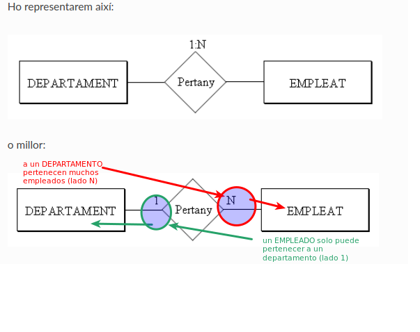

# 4. Las Relaciones del Modelo E/R

Todavía no hemos relacionado las entidades entre ellas, y por tanto todavía no hemos
dicho que tal trabajador pertenece a tal departamento (Juan Pérez está en
Contabilidad, por ejemplo), o que tal trabajador está en tal proyecto
dedicándole tantas horas semanales.
<!--
<video width="320" height="240" controls>
  <source src="T02_Peli2.mp4" type="video/mp4">
  Tu navegador no soporta la etiqueta de video.
</video>
-->

## 4.1 Relación

Todavía no hemos relacionado las entidades entre ellas, y por tanto todavía no hemos
dicho que tal trabajador pertenece a tal departamento (Juan Pérez está en
Contabilidad, por ejemplo), o que tal trabajador está en tal proyecto
dedicándole tantas horas semanales.

**RELACIÓN** es una asociación o correspondencia entre entidades.

El **TIPO DE RELACIÓN** será la estructura genérica, la asociación entre dos
tipos de entidad, y englobará las **OCURRENCIAS DE RELACIÓN**, que relacionarán
ocurrencias de las entidades (Juan Pérez pertenece al departamento de
Contabilidad, Pilar Gomis al de Ventas, ...).

Representaremos la relación por un rombo, con el nombre de la relación en el interior.
Habitualmente será un verbo que describe la relación entre las dos entidades.
Uniremos el rombo con los rectángulos de las entidades por medio de líneas.

Así tendremos:

En una Relación pueden intervenir 2 entidades (Relación Binaria), 3 entidades
(ternaria), o incluso más. Este número será el **GRADO** de la relación.

Un ejemplo de relación ternaria sería:

Y una ocurrencia de esta relación podría ser: Contabilidad compra una
calculadora a Distribuciones Garcia, S.L.

También se puede dar el caso de que solo intervenga una entidad. Entonces sería
reflexiva o de grado 1. Por ejemplo, los empleados tienen un supervisor, que
también es un empleado de la compañía.

Por último, también se puede dar el caso de que dos entidades tengan entre ellas más
de una relación. En nuestro ejemplo los empleados pertenecen a los departamentos.
Pero algunos empleados dirigen los departamentos, y esta es una relación
distinta a la anterior. Por eso conviene poner el nombre de la relación, para evitar
confusiones.

<u>**Nota**</u> 

  Quizás a medida que hagamos ejercicios nos entre pereza de poner nombre a todas las
  relaciones, sobre todo porque muchas estará muy claro qué significan. Pero
  tendremos que poner siempre el nombre en aquellas que puedan llevar a confusión o
  aquellas de las que no está claro su significado.

  

### Aplicación al ejemplo

Después de incorporar las relaciones, nuestro ejemplo quedará:

## 4.2 Atributos de Relación

Las relaciones también pueden tener atributos, igual que las entidades. Un atributo
de relación sería el número de horas que trabaja un empleado en un proyecto, que
sería un atributo de la relación **trabaja**. Por ejemplo _Juan Pérez_ trabaja
en el proyecto _Estudio rendimiento_, y le dedica 5 horas semanales. Fijaos
que no es un atributo ni de empleado ni de proyecto, sino de la relación que hay
entre ellas. Otro atributo de relación podría ser la fecha cuando un empleado
comienza a dirigir un departamento.

Representaremos los atributos de relación como los atributos de entidad, pero ahora
unidos a las relaciones.

### Aplicación al ejemplo

Pondremos en rojo los atributos de relación:

## 4.3 Tipo de Relación o Cardinalidad

Todavía no hemos reflejado toda la realidad. Por ejemplo no hemos podido expresar
que un empleado pertenece únicamente a un departamento, y en cambio puede estar en más
de un proyecto.

Esto lo haremos por medio de la cardinalidad, que nos llevará a distintas clases de
relaciones.

La **CARDINALIDAD** especifica el número de ocurrencias de una entidad que pueden
intervenir en la relación por cada ocurrencia de la otra entidad.

Una ocurrencia de EMPLEADO (un empleado concreto) solo puede estar relacionado con
una ocurrencia de DEPARTAMENTO (Juan Pérez pertenece a Contabilidad, y a ningún
otro departamento más). En cambio una ocurrencia de DEPARTAMENTO puede estar
relacionada con muchas ocurrencias de EMPLEADO (todos los que pertenecen a él).
Entonces la relación PERTENECE entre DEPARTAMENTO y EMPLEADO tiene razón de
cardinalidad **1:N** (un departamento relacionado con muchos empleados, pero un
empleado con un departamento).

Lo representaremos así:

<!--
o millor:

-->

  

Los distintos tipos de relaciones que puede haber son:

  * **1:1** (leeremos: **uno a uno**) como máximo una ocurrencia de cada. Por ejemplo la relación DIRIGE (un empleado dirige como mucho un departamento, y un departamento es dirigido por un empleado).

  * **1:N** (leeremos: **uno a ene** o **uno a muchos**) en una entidad una ocurrencia y en la otra muchas.

  * **M:N** (leeremos: **eme a ene** o **muchos a muchos**) hay más de una ocurrencia en cada entidad. Por ejemplo la relación TRABAJA (un empleado puede trabajar en más de un proyecto, y en un proyecto puede trabajar más de un empleado).

Para poder distinguir esta cardinalidad nos haremos dos preguntas, resultado
de fijar una ocurrencia en una entidad y ver cuántas ocurrencias se
relacionan en la otra entidad. Es decir, para una ocurrencia de una, cuántas
hay de la otra. En el ejemplo de más arriba:

  * A un departamento determinado, ¿cuántos empleados pueden pertenecer? (muchos).

  * Un empleado determinado, ¿a cuántos departamentos puede pertenecer? (a uno).

Estas preguntas normalmente tienen muy fácil contestación. Si hay duda
deberíamos investigar mejor en las especificaciones.

> _**Nota**_
>
> La cardinalidad M:N también la podríamos representar N:N. Sencillamente quiere decir
> que son muchas ocurrencias de cada entidad por cada una de la otra. En
> estos apuntes normalmente pondré M:N, sencillamente porque "suena" mejor.

### Aplicación al ejemplo

El ejemplo cada vez está más completo:

Licenciado bajo la [Licencia Creative Commons Reconocimiento NoComercial
CompartirIgual 3.0](http://creativecommons.org/licenses/by-nc-sa/3.0/)
