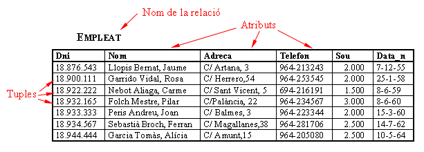
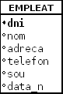

# 2. Estructura del Modelo Relacional

El elemento básico del Modelo Relacional es la **RELACIÓN**, que será una tabla o matriz bidimensional con unas características o restricciones que comentaremos más adelante.

Normalmente una relación tiene un **NOMBRE** (p.e. **Empleado**) aunque ocasionalmente no lo tendrá, por ejemplo una tabla que sea el resultado de una consulta poco frecuente.

Las **FILAS**, donde tenemos la información de las ocurrencias, de los individuos, también se llaman **TUPLAS** (a veces por similitud con ficheros también se llaman **REGISTROS**).

Las **COLUMNAS**, que serán características que nos interesan de los individuos y que en cada tupla coge un valor, las llamaremos también **ATRIBUTOS** (o **CAMPOS**).

El conjunto de valores posibles que puede tomar un atributo determinado se llama **DOMINIO**. Más adelante veremos que los dominios se intentarán definir lo mejor posible, para prevenir errores.

El **ESQUEMA o ESTRUCTURA DE LA RELACIÓN** es la definición de la relación, es decir, atributos que tiene, dominios de estos y restricciones que podremos definir, que veremos en la siguiente pregunta.

El **ESTADO DE LA RELACIÓN** es la información que contiene en un determinado momento. Normalmente el estado variará continuamente a lo largo del tiempo, bien porque se añaden nuevas tuplas (aumenta la cardinalidad), bien porque se modifica el valor de algún atributo en alguna tupla. En cambio el esquema difícilmente cambiará.

Una **CLAVE CANDIDATA** es un atributo o conjunto de atributos que identifican unívocamente cada tupla de la relación. En el ejemplo podrían ser claves candidatas **Dni**, **Nom**, incluso nos podríamos plantear combinaciones, como el conjunto **(Nom, Data_n)**, ya que parece imposible que dos personas de la empresa se llamen igual y encima hayan nacido el mismo día. De entre todas las claves candidatas elegiremos una, que será la **CLAVE PRINCIPAL** o **CLAVE PRIMARIA**, y servirá para identificar de forma efectiva en el Modelo cada una de las tuplas.

Podría darse el caso de que un atributo no tome ningún valor para una tupla determinada, por ejemplo, un empleado que no tenga teléfono. Entonces le daremos el **VALOR NULO**.

Por último, las relaciones o tablas pueden ser **PERMANENTES** o **TEMPORALES**. Las primeras se guardan. Las segundas, normalmente resultado de una consulta ocasional, no.

Representaremos la tabla con el nombre de la tabla en mayúsculas seguido, entre paréntesis, en minúsculas y separados por comas, por los nombres de los campos, con la clave principal subrayada. También es conveniente huir de los caracteres especiales (vocales acentuadas, ç, ñ, guión, ...) para no tener problemas cuando vayamos a implementarla en un SGBD determinado (Access, Oracle, PostgreSQL, ...). Para una mejor lectura intentaremos poner siempre la clave principal al principio, el o los primeros campos.

<code>EMPLEADO (<u>dni</u>, nombre, direccion, telefono, sueldo, fecha_n)</code>

También podemos utilizar una forma alternativa de representarla, con un recuadro que coge toda la tabla, arriba el nombre de la tabla, y abajo cada uno de los campos, poniendo la clave principal en negrita o subrayada.

Licenciado bajo la [Licencia Creative Commons Reconocimiento NoComercial CompartirIgual 3.0](http://creativecommons.org/licenses/by-nc-sa/3.0/)
