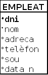
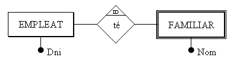
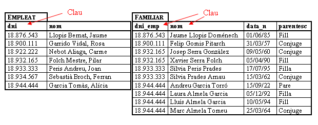
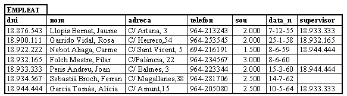
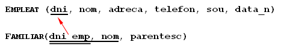
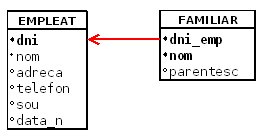

# 3. Restricciones

Al igual que en otros modelos de datos, en el Modelo Relacional existen restricciones, es decir, estructuras u ocurrencias no permitidas.

Estas restricciones pueden ser de dos tipos fundamentales: **restricciones inherentes**, que son impuestas por el propio modelo, y **restricciones de usuario** (también llamadas restricciones **semánticas**) en las cuales es el usuario quien prohíbe, porque el modelo se lo permite, determinadas circunstancias para poder definir mejor la Base de Datos.

## 3.1 Restricciones inherentes

Como hemos dicho son las que impone el propio modelo. Algunas son características que han de cumplir las relaciones. Por tanto no cualquier tabla matemática es una relación. Podemos considerar las siguientes:

  * **Valores atómicos**: cada valor de la tabla, es decir, cualquier valor de cualquier atributo de cualquier tupla ha de ser simple, no divisible. Por tanto no valen atributos compuestos o repetitivos.

> Así, si consideramos **Nombre** en la relación **Empleado** como nombre de pila más apellidos, no será divisible (no podré coger posteriormente el nombre de pila por un lado y los apellidos por otro; si lo quisiera hacer, se tendrían que definir los atributos simples **Apellido1**, **Apellido2** y **Nombre**).

> Tampoco valen valores repetitivos, por ejemplo un vector de 12 entradas. Quedan por tanto descartados los atributos **_multivaluados_**.

  * **Tuplas distintas**: no pueden haber dos tuplas iguales. Esto es una diferencia respecto a las tablas matemáticas donde sí que se pueden duplicar filas. 

  

  * **El orden de las tuplas no es significativo**. 

  

  * **El orden de los atributos no es significativo**. 

## 3.2 Restricciones de usuario

Las anteriores son condiciones, imposiciones que nos da el mismo modelo.

Las realmente interesantes para nosotros son las restricciones de usuario, también llamadas restricciones semánticas, ya que serán condiciones que podremos poner nosotros para que el esquema de la B.D. explique lo mejor posible la realidad, y evitar posibles errores en los datos.

### 3.2.1 Restricción de dominio

El valor de un atributo ha de ser un valor atómico del dominio. Definiendo claramente el dominio nos aseguramos (dentro de lo posible) que el atributo no pueda tomar valores incorrectos.

Por un lado, el dominio será de un tipo determinado, elegido de una gama bastante extensa: entero corto, entero, entero largo, real, doble precisión, carácter, cadena de caracteres (texto), fecha, hora, ...

Así, por ejemplo, definiendo el _Sueldo_ como un número real impediremos que por error pueda tomar el valor 2.**R** 00'00, o que la _fecha de nacimiento_, con dominio de tipo fecha, sea 15-**14** -1958 o **31** -**2** -1958.

También se podrán definir dominios que estén en un determinado intervalo (nota de un examen: 0-10) o de un tipo enumerado (nota de evaluación: MD, IN, SUF, BI, NOT, SOB).

### 3.2.2 Restricción de clave principal

Permite declarar un atributo o un conjunto de atributos como **CLAVE PRINCIPAL** o **PRIMARIA** (Primary Key). Esta clave principal servirá para identificar unívocamente cada una de las filas.

Como consecuencia de lo anterior, la clave principal no podrá tomar valores nulos ni repetidos, ya que en caso contrario no se podría asegurar la identificación de las filas.

Estas últimas características también las podrán tener otros atributos, cosa que da lugar a los tipos de restricción que se ven en los siguientes puntos.

Nosotros siempre definiremos una clave principal. Si tenemos claves candidatas, elegimos una de ellas como clave principal. Si no tenemos, nos inventamos un campo que servirá de clave principal (bien un número o bien un código alfanumérico).

No es conveniente que la clave principal esté formada por un número excesivo de campos. Podríamos decir que 3 es el máximo. Si la clave candidata está formada por más de 3 campos, o bien elegimos otra clave candidata, o bien nos inventamos una.

Lo representaremos así:

<code>EMPLEADO (<u>dni</u>, nombre, direccion, telefono, sueldo, fecha_n)</code>

### 3.2.3 Restricción de unicidad

Si en un campo, o en un conjunto de campos, definimos la restricción de unicidad (**UNIQUE**), esto obliga a que, en caso de tener valores el campo, no se puedan repetir. Supongamos, por ejemplo, los alumnos de un Instituto. La clave no puede ser el DNI, ya que algunos alumnos no tendrán, pero en caso de tenerlo, está claro que no se podrá repetir.

Representaremos que un campo es único, poniendo **único** entre paréntesis debajo del campo. Por ejemplo, si consideramos que el campo nombre de la tabla EMPLEADO ha de ser único, lo representaremos así:

<code>EMPLEADO (<u>dni</u> , nombre, direccion, telefono, sueldo, fecha_n)
              (único)</code>

### 3.2.4 Restricción de valor no nulo

Obliga a que el campo tome siempre un valor. Por ejemplo, el campo **Nombre** es un buen candidato a ser no nulo.

Lo representaremos poniendo **no nulo** entre paréntesis debajo del campo.

<code>EMPLEADO (<u>dni</u> , nombre, direccion, telefono, sueldo, fecha_n)
              (no nulo)</code>

Por medio de la representación alternativa, podemos marcar con un punto negro delante del campo no nulo.

### 3.2.5 Integridad referencial

Para poder explicarla nos apoyaremos en un ejemplo.

que se podría traducir en las siguientes tablas:

Si en una tabla R2 (**Familiar**) tenemos un atributo (**dni_emp**) que es clave (primaria o candidata) de otra tabla R1 (**Empleado****\-- > dni**), todo valor de aquel atributo ha de concordar con un valor de la clave de R1 (no he de poder poner en familiar un Dni que no lo tenga ningún empleado de la empresa). El atributo en R2 es, por tanto, una **CLAVE EXTERNA**.

Ha de ser imposible poner en **Familiar** el Dni 18.754.321, porque no está en la otra, y por tanto no es un Dni de un empleado de la empresa.

Las relaciones R1 y R2 no tienen por qué ser distintas, pueden ser la misma. Así, si consideramos el supervisor, este ha de ser de la empresa:

Supervisor es una clave externa, pero de la misma tabla. No todos los SGBD permiten una clave externa reflexiva.

Una manera de representar las claves externas en el esquema es la siguiente:

  
Donde el doble subrayado indica una clave externa (que en este ejemplo, además, forma parte de la clave principal, pero que no siempre será así) que “apunta” a la clave principal de la otra tabla.

La otra manera, utilizando la forma alternativa, será esta, que también es muy fácil de entender:

Esto nos impedirá que introduzcamos valores no correctos, no existentes. ¿Pero qué pasará si borramos un empleado, o si modificamos su Dni? ¿Qué hacemos con los familiares? Pues en principio tres podrían ser las acciones a realizar, y dependiendo de la situación particular elegiríamos una u otra:

  * No dejar borrarlo o modificarlo (**NO ACTION**).  
Seguramente no es la opción más adecuada para el ejemplo de los empleados y los familiares. Pero pensemos en otro ejemplo, con clientes y facturas. ¿Qué hacemos si se borra un cliente y tenemos facturas de él? Segurament lo más adecuado será no hacer la acción, es decir, no borrar el cliente (sobre todo si las facturas están pendientes de cobrar ...).

  * Borrar también los familiares o cambiarlos **en cascada**(**CASCADE**).  
Seguramente esta es la opción más adecuada para el caso de los familiares, que se eliminan automáticamente.

  * Cambiar el valor de la clave externa al valor nulo o un valor predeterminado (**SET NULL** o **SET DEFAULT**).  
En el ejemplo de los familiares no tiene sentido ya que no nos interesan los familiares de los que no son de la empresa. Pero imaginemos, por ejemplo, un proveedor que nos ha proporcionado unos artículos. Por el hecho de no trabajar ya con el proveedor y quitarlo de la B.D. no deberíamos eliminar los artículos. Sería suficiente con dar un valor nulo al proveedor de este artículo. Observemos, sin embargo, que esta clave externa debería admitir valores nulos. Si no lo permite, mejor un valor por defecto.

Hay SGBD que incluso permiten acciones distintas para el caso de borrado y de actualización de la clave, como por ejemplo Access.

### 3.2.6 Restricciones externas

A pesar de todas las restricciones anteriores, que normalmente los SGBDR cumplen, hay otras que no se pueden expresar por medio del Modelo Relacional, y por tanto no pueden cumplir directamente los SGBDR. Son las **restricciones externas al esquema relacional**. Estarán normalmente las heredadas del Modelo E/R, y habrán algunas más que sí que se podían expresar en el Modelo E/R, pero no en el Modelo Relacional. Las veremos en la pregunta 4.

Los SGBDR más avanzados, más potentes, permitirán un tratamiento a estas restricciones externas, consistentes en ejecutar un procedimiento definido por el usuario después de una actualización. Son los **Disparadores**(**TRIGGERS**). Este concepto es muy potente, ya que da una respuesta procedimental donde se puede hacer cualquier cosa.

Licenciado bajo la [Licencia Creative Commons Reconocimiento NoComercial CompartirIgual 3.0](http://creativecommons.org/licenses/by-nc-sa/3.0/)
