# 4. Transformación del M. E/R al M. Relacional

A continuación veremos las reglas de transformación del esquema en el Modelo E/R al Modelo Relacional.

De esta manera continuamos el proceso de diseño de una Base de Datos. En el Tema 2 hemos aprendido a hacer el esquema en el Modelo Entidad-Relación. Ahora lo traduciremos al Modelo Relacional, y ya se podrá implementar en cualquier SGBD Relacional. Faltaría solo el proceso de Normalización (tema 4) para terminar de dejar las tablas perfectamente diseñadas. De todas formas las Bases de Datos que diseñemos nosotros, con el proceso descrito anteriormente, tendrán unas tablas muy "normalizadas", siempre que diseñemos bien.

## 4.1 Entidades

Toda entidad se transformará en una tabla, con todos sus atributos, que se considerarán como simples. Se elige uno (o un conjunto) como clave principal, y lo denotaremos subrayándolo. Las entidades débiles las estudiaremos mejor más adelante.

En nuestro ejemplo, como teníamos 4 entidades, nos saldrán de momento 4 tablas:

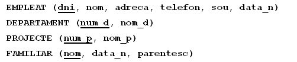

No consideraremos los atributos multivaluados. Los trataremos y solucionaremos en el tema siguiente, el de **Normalización**.

## 4.2 Relaciones 1:N

Por cada relación 1:N entre las entidades **A** y **B**, donde **A** es la que participa con grado de cardinalidad 1, y **B** con grado N, se incluye un nuevo campo en **B** (del mismo tipo que la clave principal de **A**) que además será **clave externa** que apuntará a **A**, más concretamente a la clave principal de **A**. En muchas ocasiones al campo nuevo de **B** se le pone el mismo nombre que a la clave principal de **A**, pero no es necesario, depende del gusto de cada uno.

También se incluirán en **B** todos los posibles atributos de la relación.

La siguiente animación intenta explicarlo mejor:

<iframe src="https://slides.com/aliciasalvador/bd-t3-exemple_clau_externa/embed" width="576" height="420" title="Copy of BD-T3-exemple_clau_externa" scrolling="no" frameborder="0" webkitallowfullscreen mozallowfullscreen allowfullscreen></iframe>
  
Si además la entidad que participa con grado N lo hace de forma **total** (como en la figura de abajo), la clave externa **no puede ser nula** (es decir siempre ha de tener un valor).

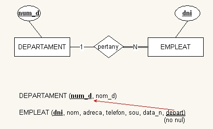

En nuestro ejemplo:

  * Por la relación **_Pertenece_** (figura de arriba) incluiremos el atributo **departamento** a **Empleado**, que además deberá ser no nulo.

  * Por la relación **_Controla_** incluiremos el atributo **departamento** a **Proyecto** (no nulo).

  * Por la relación **_Supervisa_** incluiremos el atributo **supervisor** a **Empleado** (es reflexiva), pero este sí que puede ser nulo. Aunque parezca extraño, un campo puede ser clave externa que apunta a la clave principal de la misma tabla.

  * Por la relación **_Tiene_** entre empleado y familiar, incluiremos en **FAMILIAR** el atributo **dni_e**, pero como Familiar es débil la veremos mejor un poco más adelante.

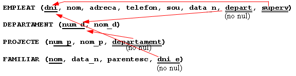

## 4.3 Relaciones M:N

Por cada relación **M:N** construiremos una **nueva tabla** donde se incluirán como clave externa las claves principales de las dos entidades, y además su combinación constituirá (o formará parte de) la clave principal. Incluiremos también los posibles atributos de la relación.

En el ejemplo:

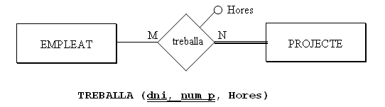

Cada vez que nos encontramos con una relación M:N y la traducimos por una nueva tabla tendremos que **preguntarnos si es suficiente con la clave principal** formada por las dos claves externas, o si hace falta añadir otro campo. Tenemos que ser conscientes de que la clave principal no pueda repetirse, que haya 2 filas con la misma clave principal. Así, en el ejemplo, nos tendríamos que hacer la siguiente pregunta: ¿puede un empleado trabajar en el mismo proyecto más de una vez? En este caso la respuesta es negativa, y por tanto es suficiente con esta clave principal.

Pero supongamos que la respuesta es que sí que puede trabajar más de una vez a lo largo del tiempo. En este caso sería una especie de histórico, donde haría falta, además, saber cuándo empieza y cuándo termina de trabajar en un proyecto un determinado trabajador (serían atributos de la relación):

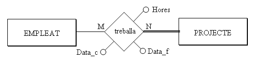

  
Entonces, como no es suficiente con la clave principal formada por las dos claves externas, incluiremos otro campo en la clave principal. Parece que lo más adecuado sería **Fecha_c** (ya no se puede dar el caso de que el mismo trabajador trabaje más de una vez en el mismo proyecto, empezando el mismo día)

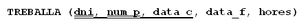

Pero por otro lado, las claves principales muy largas no son operativas, y aunque la traducción literal sea como hemos dicho, por motivos prácticos podemos cambiar la clave principal. Consideraremos que el número máximo de campos en la clave principal es de 3. 4 ya son demasiados, y entonces buscaremos otra clave principal (un código de trabajo, por ejemplo). Las claves externas continuarían siéndolo.

## 4.4 Relaciones 1:1

No hay una forma única de traducir estas relaciones. Tres serán las posibles traducciones, según la participación total o parcial de las entidades en la relación, y también según lo que nos diga el "_sentido común_".

  * Si de las dos entidades que entran en la relación, **A** y **B**, una de ellas y solo una, participa de forma total, por ejemplo **B**, traduciremos la relación 1:1 como una **clave externa** en la tabla correspondiente a la entidad que participa de forma total (**B**). Podemos obligar también a que este campo que será clave externa sea **no nulo** (ya que todas las ocurrencias de **B** entran en la relación). También podemos hacer que este campo sea **único** (no se podrá repetir, ya que si se pudiese repetir sería una relación 1:N). Además, incluiremos en **B** todos los posibles atributos de la relación. 

> Por ejemplo, la relación **_dirige_**, que es 1:1 entre **EMPLEADO** y **DEPARTAMENTO**:

> 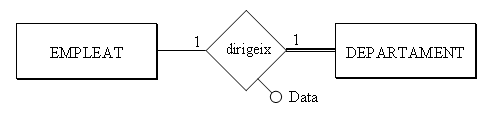  
>

> Como la entidad de la derecha participa de forma total, elegiremos **DEPARTAMENTO**:

>   
>

> Lo hacemos de esta manera porque todos los departamentos tienen director, pero no todos los empleados son directores. Si pusiéramos la clave externa en la tabla **EMPLEADO** (se llamaría por ejemplo **dep_que_dirige**) muchas veces estaría vacío, ya que relativamente son pocos los empleados que dirigen un departamento.

> Veamos otro ejemplo de relación 1:1, el de las mariposas. Teníamos una relación 1:1 entre **PERSONA** y **COLECCIÓN**

> 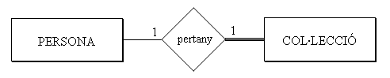  
>

> Elegiríamos **COLECCIÓN**, ya que entra de forma plena o total en la relación.

> 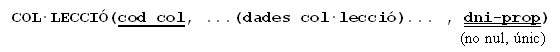  
>

  * Si las dos entidades participan de forma total, se puede considerar todo (las dos entidades y la relación, con sus posibles atributos) como una sola tabla. En la práctica esto será bastante extraño, porque ya lo habríamos considerado una sola entidad. Por ejemplo, consideremos que todas las personas que estudiamos tienen una colección: 

> 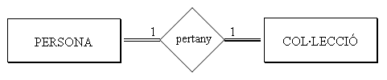  
>

> Entonces podríamos considerar una única tabla, que contenga los datos de la persona y de su colección:

>   
>

> De todas formas, puede que nos interese (para separar claramente los dos tipos de información) dos tablas. Entonces podríamos traducirlo como en el primer punto, con una clave externa (no nula) en una de las dos tablas, y tendríamos que elegir la tabla que _menos_ se utilice.

  * Si las dos entidades participan de forma parcial, dado que si ponemos una clave externa en una de las dos, muchas veces tendrá valor nulo, podemos traducirla como una nueva tabla que marque la relación, donde habrá una tupla por cada relación entre dos ocurrencias. Incluiríamos en la nueva tabla los posibles atributos de la relación. 

> En el ejemplo podría ser que las colecciones pertenecen a una persona particular o a una institución (no tienen propietario):

> 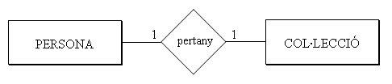

> Quedaría:

> 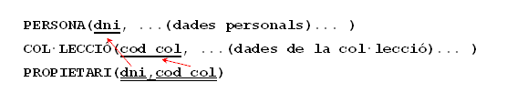

> Pero como comentábamos al principio, tendremos que aplicar el sentido común, ya que quizás una de las dos podría participar de forma "casi" total (por ejemplo, casi todas las colecciones son de una persona). Entonces podría ser mejor traducirlo como en el primer caso, poniendo la clave externa en la que participa de forma "casi" total, ya que esta tendrá relativamente pocos valores nulos, y sería más costoso mantener otra tabla. Evidentemente la clave externa sí que podría ser nula, en este caso.
>
>  

Resumiendo, **una relación 1:1 casi siempre la traduciremos como una clave externa en la tabla que participa en la relación de forma total o casi total** (o la que previsiblemente tiene más ocurrencias en la relación)

## 4.5 Entidades débiles

Las entidades débiles, como mínimo dependen de otra, podremos ser más restrictivos que las otras. Una entidad siempre es débil a través, como mínimo, de una relación que la comunica con la entidad principal. Además participa de forma total (como no puede existir sin la otra, toda ocurrencia está en la relación).

Por lo tanto, toda entidad débil tendrá una clave externa, que apunta a la principal y será no nula. Pero aún podemos ir más allá:

  * **Dependencia en existencia**: haremos que la clave externa **borre y actualice en cascada**, ya que si deja de existir la principal no tiene sentido la débil.

  * **Dependencia en identificación**: además de borrar y actualizar en cascada, la clave externa **formará parte de la clave principal**.

> Si la relación por la cual depende en identificación es 1:N, hará falta otro campo en la clave principal.

> Si es 1:1, con la clave externa es suficiente como clave principal

En nuestro ejemplo quedará así:

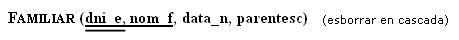

## 4.6 Resumen dependencias

Vamos a hacer un cuadro resumen con distintos grados de dependencia entre dos relaciones y cómo se traduciría al Modelo Relacional:

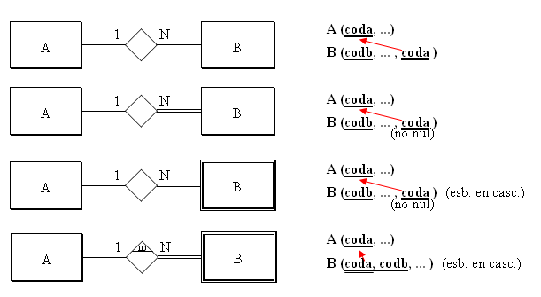

Por otro lado, si nos encontramos una entidad débil que depende en identificación a través de una relación 1:1, es suficiente con la clave principal de A como clave principal de B

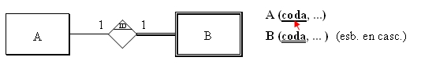

Otra cuestión que puede llevar a confusión es el caso de las claves externas formadas por 2 campos. Nos basaremos en el ejemplo de siempre, en la tabla FAMILIAR, ya que tiene una clave principal formada por 2 campos. Supongamos que hay en el Modelo Entidad-Relación una tabla que depende de ella, como podría ser comunicaciones que se le han hecho (cartas). Las entidades y la relación entre ellas podría ser esta:

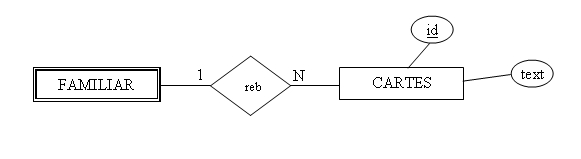

Como la relación es de tipo 1:N la traduciremos por una clave externa en CARTAS. ¿Y cuál será la clave externa? Como la tabla FAMILIAR tiene una clave principal formada por 2 campos, tendremos que poner una clave externa formada por 2 campos. ¡Alerta! no serán 2 claves externas, sino una clave externa formada por 2 campos. Como siempre, representaremos la clave externa con un doble subrayado, que ahora abarcará los 2 campos.

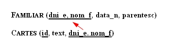

## 4.7 Relaciones ternarias

En una relación ternaria o superior construiremos una nueva tabla, donde incluiremos como claves externas las claves primarias de todas las entidades, y además los atributos de la relación.

Habitualmente, la clave principal de la nueva tabla será la combinación de todas las claves principales de las entidades. Ocasionalmente, si alguna entidad participa con cardinalidad 1, la clave principal de esta entidad no entraría a formar parte de la clave principal de la nueva tabla.

Al igual que en el caso de las relaciones M:N, nos tendremos que preguntar si es suficiente con la clave primaria generada o si se tendrá que incluir algún otro campo.

En el ejemplo que pusimos de relación ternaria, suponiendo los atributos de la relación la fecha de compra y la cantidad:

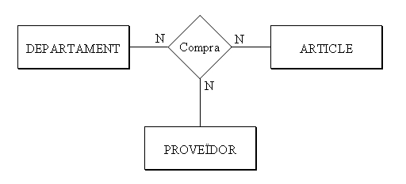

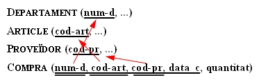

Donde hemos puesto todas las claves externas formando parte de la clave principal, ya que todas entran con cardinalidad N. Pero no teníamos suficiente con esta clave principal, ya que el mismo departamento puede comprar el mismo artículo al mismo proveedor más de una vez. Como no teníamos suficiente, hemos puesto otro campo.

Sería momento, seguramente, de sustituir la clave principal que está formada por 4 campos, ya que son demasiados.

Pondríamos otra clave principal, pero las claves externas continuarían siéndolo, y además serían no nulas:

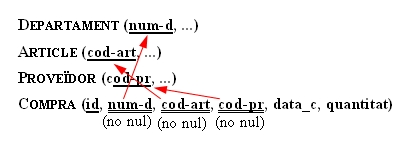

## 4.8 Especializaciones

Este aspecto, como en el caso de las relaciones 1:1, también tiene múltiples soluciones. El problema de las especializaciones es que, aunque de forma teórica la solución sea correcta, en la práctica supone muchas tablas y con un cierto grado de mantenimiento entre ellas. Por lo tanto, y aplicando el sentido común, muchas veces se hace una simplificación, quitando bien las subclases, bien la superclase, como veremos a continuación. Estas son las posibilidades:

  * Transformar las especializaciones en tablas con la clave principal heredada y los atributos específicos (como si sustituyéramos la especialización en relaciones 1:1, con las subclases dependiendo en identificación de la superclase). Estaría también bien añadir un atributo a la superclase para poder saber de qué tipo es. En el ejemplo nos quedaría:

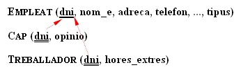

  * Simplificar las subclases. Entonces todos los atributos de estas deberían pasar a la superclase. También se deberían pasar todas las relaciones que afectan a las subclases, "retocando" las participaciones totales (que ahora ya no lo serían). Ahora será obligatorio tener el campo que distingue el tipo (si no, perderíamos esta información).

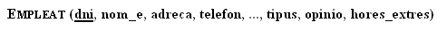

  * Simplificar la superclase. Entonces todos los atributos de esta pasarían a cada una de las subclases. También pasarían las relaciones a cada una de estas, "retocando" las participaciones totales.

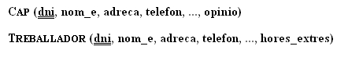

## 4.9 Restricciones externas

Ya hemos comentado que restricciones externas son restricciones que no se pueden expresar por medio del modelo de datos. Entonces las expresaremos de palabra.

Normalmente, las restricciones externas del Modelo E/R continuarán siéndolo en el Modelo Relacional, porque tampoco se podrán expresar. En nuestro ejemplo teníamos las restricciones externas del Modelo E/R:

> **Rex1**: El jefe de un departamento debe ser miembro de este.

> **Rex2**: Un empleado solo puede trabajar en proyectos coordinados por su departamento.

Esto tampoco se puede expresar con el Modelo Relacional, por lo tanto las mantendremos.

Aparte, se pueden crear más restricciones externas, porque con el Modelo Relacional no se puede expresar todo lo que se podía expresar con el Modelo E/R. Por ejemplo, en la relación:

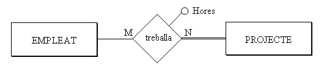

ya hemos comentado que dará lugar, aparte de las tablas de las entidades, a otra tabla:

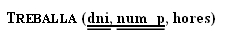

donde **dni** y **num_p** son claves externas. Pero la entidad proyecto participa de forma total en la relación, es decir, en todo proyecto debe haber un empleado trabajando. ¿Cómo controlamos esto? Pues es una nueva restricción externa que la podríamos formular así:

> **RexR3**: Todo proyecto debe tener como mínimo un empleado trabajando en él.

Las participaciones totales que nos supondrán una restricción externa son:

  * En una relación **1:N**, una participación total de la entidad que participa con grado 1.
  

  * En una relación **M:N**, cualquier participación total (si las dos participan de forma total, entonces habrá dos restricciones externas).
  

  * En una relación **1:1**, depende de la manera de traducirse.

La manera de implementar las restricciones externas será por medio de un TRIGGER, que se active cuando haya una actualización (inserción, modificación o borrado) que afecte a la restricción externa. Por ejemplo, en la restricción **RexR3** los momentos importantes son después de insertar un nuevo proyecto, y antes de eliminar o modificar en la tabla **Trabaja** (por si un proyecto se queda sin gente trabajando en él).

Las acciones a desarrollar podrían ser sacar un aviso, o obligar a insertar como mínimo una tupla en la tabla **Trabaja**, en el caso de la inserción de un nuevo proyecto; en el caso de modificación o eliminación en **Trabaja** podría impedirse esta actualización.

En nuestro ejemplo tendremos las restricciones externas al Modelo Relacional:

> **RexR1**: El jefe de un departamento debe ser miembro de este.

> **RexR2**: Un empleado solo puede trabajar en proyectos coordinados por su departamento.

> **RexR3**: Todo proyecto debe tener como mínimo un empleado trabajando en él.

## 4.10 Ejemplo

Vamos a ver cómo quedará definitivamente la traducción del ejemplo que estamos arrastrando desde el Tema 2. Daremos 2 versiones, teniendo en cuenta o no la especialización de que el trabajador puede ser jefe o trabajador normal.

Sin tener en cuenta la especialización tendremos esta solución:

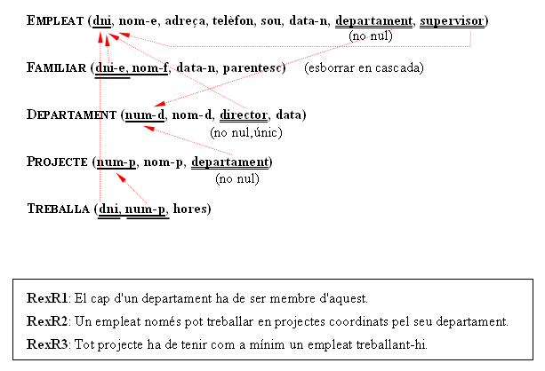

este vídeo explica todo el proceso paso a paso:

<iframe src="https://slides.com/aliciasalvador/bd-t3-video_exemple_er_rel/embed" width="600" height="500" title="Copy of BD-T3-video_exemple_er_rel" scrolling="no" frameborder="0" webkitallowfullscreen mozallowfullscreen allowfullscreen></iframe>

Y esta sería la forma alternativa de representarlo:

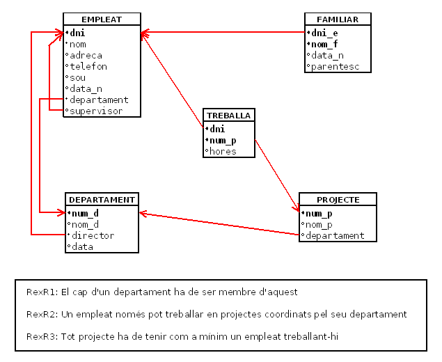

Y teniendo en cuenta la especialización:

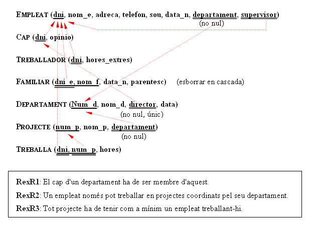

que este vídeo explica en los puntos diferentes a la anterior solución

<iframe src="https://slides.com/aliciasalvador/bd-t3-video_exemple_er_rel_esp/embed" width="600" height="500" title="Copy of BD-T3-video_exemple_er_rel_esp" scrolling="no" frameborder="0" webkitallowfullscreen mozallowfullscreen allowfullscreen></iframe>

Y aquí tendríamos la representación alternativa:

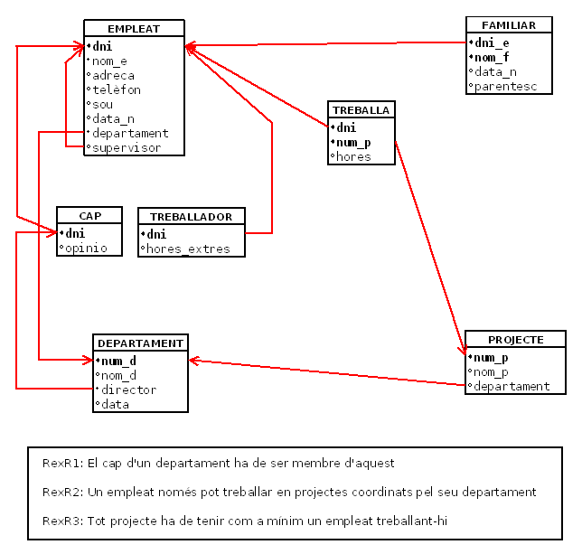

Licenciado bajo la [Licencia Creative Commons Reconocimiento NoComercial CompartirIgual 3.0](http://creativecommons.org/licenses/by-nc-sa/3.0/)
