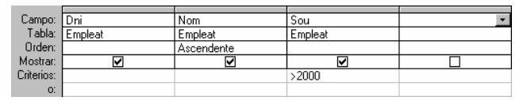

# 5. Lenguajes relacionales

Hasta el momento hemos diseñado una B.D. Relacional. Pero si queremos la B.D. es para consultarla, sacar la información que nos interesa, manipularla. Nos hará falta, por lo tanto, un lenguaje de manipulación de la B.D. (**DML**). Estos lenguajes pueden estar basados en el Álgebra Relacional o en el Cálculo Relacional.

  * Por medio del **ÁLGEBRA RELACIONAL** haremos operaciones sobre las tablas, combinándolas, seleccionando lo que nos importa, ..., en definitiva manipulándolas. El resultado será una nueva tabla, que será el resultado final o servirá para hacer otra operación. Las operaciones pueden ser **proyección** (coger algunas columnas de una tabla), **selección** (seleccionar algunas filas de una tabla, las que cumplen una determinada condición), **unión**, **intersección**, **producto cartesiano**, **reunión**...

> El lenguaje **SQL**, que es el estándar de hecho y que veremos en el tema 6, está basado en el Álgebra relacional. Las sentencias son de la forma:
~~~
SELECT dni, nombre, sueldo  
FROM EMPLEADO  
WHERE sueldo > 2000
~~~
> donde estamos proyectando sobre los campos dni, nombre y sueldo, y seleccionando las filas que cumplen la condición del final
>
> Vamos a comentar dos de las operaciones mencionadas antes. El **producto cartesiano** de dos tablas consiste en combinar cada una de las filas de una tabla con cada una de las filas de la otra. Así, el producto cartesiano de **Empleado** y **Departamento** sería:
~~~
SELECT dni, nombre, nombre_d  
FROM EMPLEADO, DEPARTAMENTO
~~~
> Pero esta operación no parece tener mucho sentido en este caso ¿para qué queremos combinar un empleado con todos los departamentos de la empresa? Parece mucho más lógico combinar cada empleado únicamente con el departamento al cual pertenece.

> La **reunión** de dos tablas consiste en hacer un producto cartesiano y después seleccionar las filas que tienen el mismo valor en dos campos determinados (uno de cada tabla).
~~~
SELECT dni, nombre, nombre_d  
FROM EMPLEADO, DEPARTAMENTO  
WHERE EMPLEADO.departamento = DEPARTAMENTO.num_d
~~~
> Es decir, del producto cartesiano seleccionamos solo las filas en las cuales coinciden los campos departamento y num_d, combinando cada empleado con su departamento.

  * En el **CÁLCULO RELACIONAL**, se definen variables de tipo **tabla**, se utilizan operadores entre las variables, y también unos cuantificadores (_**para todo**_ y _**existe**_). Va de forma paralela al álgebra de manera que se pueden obtener las mismas cosas con el Álgebra y con el Cálculo.

> El **QBE** (Query By Example) se basa en el cálculo relacional, y su particularidad es la sencillez de hacer consultas para los no expertos. Por medio de una plantilla podremos colocar los atributos que queremos visualizar, el orden, los criterios de selección, etc. Es lo que utilizan tanto **Access** como **Base** para hacer las consultas con el asistente.

> 

Licenciado bajo la [Licencia Creative Commons Reconocimiento NoComercial CompartirIgual 3.0](http://creativecommons.org/licenses/by-nc-sa/3.0/)
