# 6. Ejercicios

##  Ejercicio 1

Realizar el esquema relacional correspondiente al ejercicio 1 del Tema 2.

Recordad que teníamos 3 opciones:

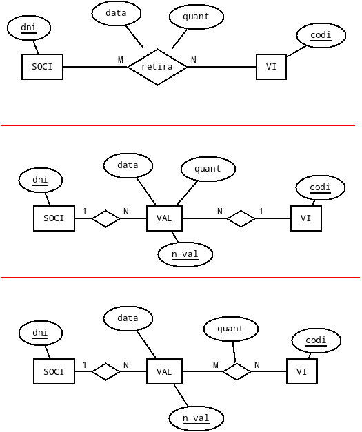

##  Ejercicio 2

Realizar el esquema relacional correspondiente al ejercicio 2 del Tema 2.

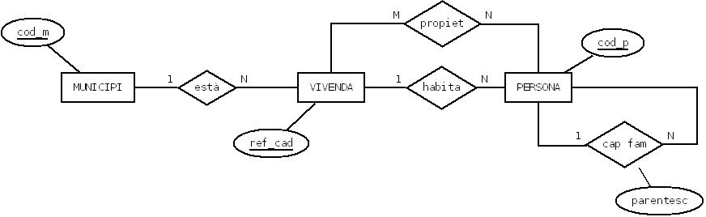

##  Ejercicio 3

Realizar el esquema relacional correspondiente al ejercicio 3 del Tema 2.

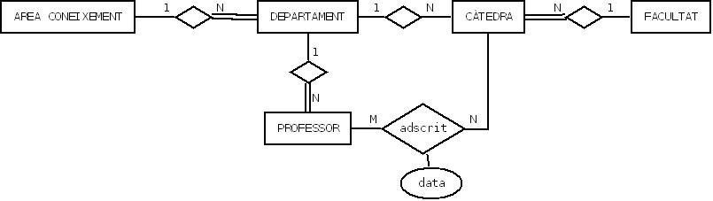

##  Ejercicio 4

Realizar el esquema relacional correspondiente al ejercicio 4 del Tema 2.
Recordad que el rombo con doble raya significa dependencia en identificación;

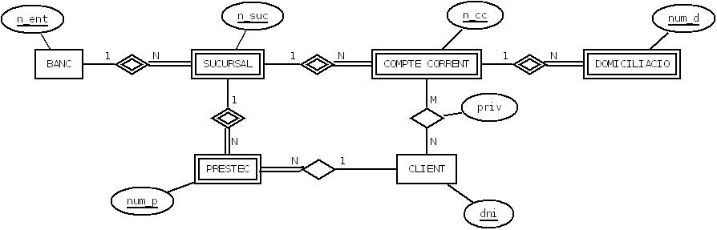

##  Ejercicio 5

Realizar el esquema relacional correspondiente al ejercicio 5 del Tema 2.

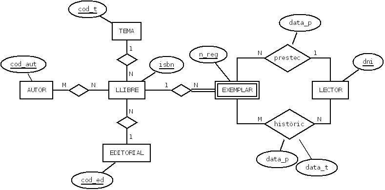

##  Ejercicio 6

Realizar el esquema relacional correspondiente al ejercicio 6 del Tema 2.

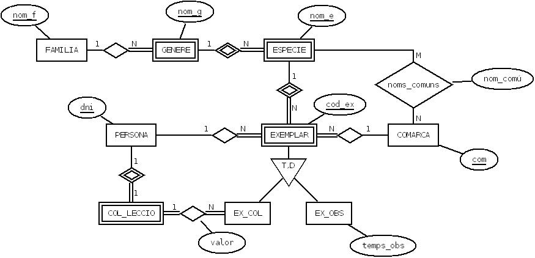

##  Ejercicio 7

Realizar el esquema relacional correspondiente a una empresa de líneas ferroviarias.

En la de arriba consideramos únicamente los viajes (y no los trayectos). Además, solo marcamos estación de origen y de destino de un viaje.

En la segunda incorporamos los trayectos, y además marcamos todas las estaciones donde se para en un trayecto.

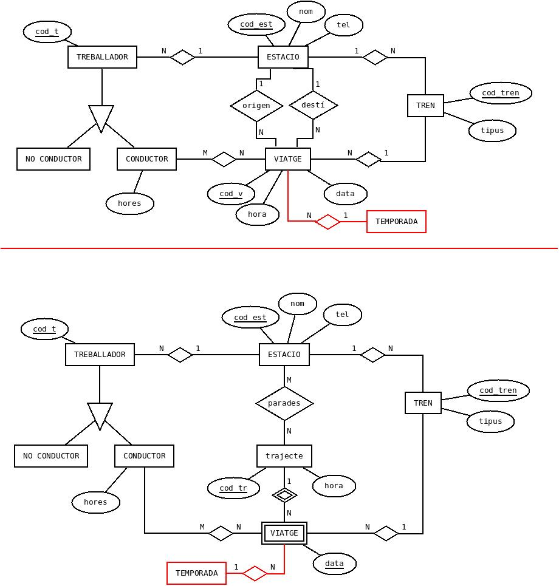

##  Ejercicio 8

Realizar el esquema relacional correspondiente a un sistema de información sobre el material informático de una empresa.

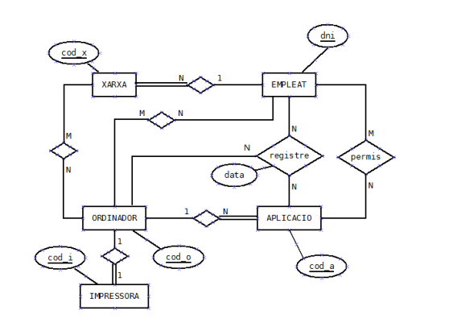

<!--
Se desea mantener información sobre el material informático de una empresa.

  * La empresa tiene unas cuantas redes, interconectadas algunas de ellas.
  * La mayor parte de los ordenadores están conectados en red, aunque otros no lo están. También existen ordenadores que están conectados a más de una red (son puentes).
  * Cada ordenador puede ser utilizado por uno o más de un empleado. Un empleado puede tener permiso para utilizar uno o más de un ordenador.
  * Una red (o segmento) es responsabilidad de un único empleado que la gestiona. Este empleado puede tener bajo su responsabilidad más de una red.
  * Cada ordenador puede tener conectada como máximo una impresora. No se contemplan las impresoras de red. Siempre estarán conectadas por el puerto paralelo a un ordenador.
  * Las aplicaciones de la empresa están almacenadas en los ordenadores y no están duplicadas (una aplicación está en un único ordenador). Los empleados que tienen acceso a este ordenador tendrán, por tanto, acceso también a las aplicaciones que el ordenador contiene. Además tendrán acceso a otras aplicaciones a través de la red. Cada aplicación tiene asignados permisos para los usuarios que pueden acceder a través de la red.

  
Se quiere que el sistema de información sea capaz de responder a consultas como:

Para una red:

  * Empleado responsable de la misma.
  * Ordenadores que la componen.
  * Impresoras en la red.
  * Aplicaciones dentro de la red.

Para un ordenador:

  * Redes a las que está conectado.
  * Impresora conectada (si tiene).
  * Aplicaciones que contiene.
  * Empleados que pueden utilizarlo.
  * Saber si es puente o no.

Para un empleado:

  * Ordenadores que puede utilizar.
  * Aplicaciones a las que tiene acceso.

Para una aplicación:

  * Por motivos de seguridad se quiere conocer, por cada acceso a ella, el empleado que accedió, la fecha y el ordenador desde el cual se accedió.
  * En qué ordenador está guardada.
  * Empleados que pueden acceder.

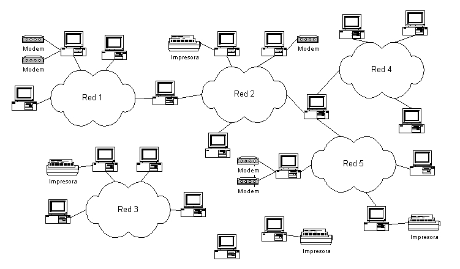

_**Nota**_

Observad cómo por un lado debéis guardar los permisos de los empleados sobre las aplicaciones, y por otro los accesos reales hechos por los empleados a las aplicaciones, y en este caso hemos de saber desde qué ordenador y la fecha.
-->

##  Ejercicio 9

Realizar el esquema relacional correspondiente a un sistema de información de una empresa que vende gran variedad de productos. Para la venta de estos productos, dispone de un conjunto de viajantes que realizan visitas a los clientes ofreciendo sus productos.

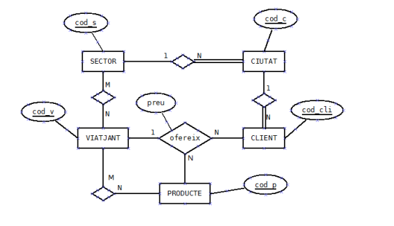

<!--
Diseñar el diagrama E-R, y traducirlo después al relacional, de un sistema de información de una empresa que vende gran variedad de productos. Para la venta de estos productos, dispone de un conjunto de viajantes que realizan visitas a los clientes ofreciendo sus productos.

La zona geográfica de influencia de la empresa está dividida en sectores no solapados que comprenden unas cuantas ciudades. Un viajante tiene asignados algunos de estos sectores. Esto no significa que tenga asignados los sectores en exclusividad; más de un viajante puede tener asignado el mismo sector.

A un determinado cliente le pueden ofrecer productos distintos viajantes de la empresa, pero nunca el mismo producto.

Un producto puede ser ofrecido por distintos viajantes, pero siempre a clientes distintos. Un viajante no ofrece todos los productos (solo algunos). A un cliente siempre le ofrece un producto el mismo viajante.

Un producto es ofrecido por un viajante a clientes distintos a precios distintos.

El sistema de información ha de ser capaz de responder a consultas como:

  * Qué clientes hay en un sector.
  * Qué clientes hay en una ciudad.
  * Qué productos son ofrecidos a un cliente y a qué precio.
  * Qué clientes tiene asignado cada viajante.
  * Qué productos se ofrecen en un determinado sector.
  * Qué ciudades tiene asignadas un viajante (por estar dentro de sus sectores).
  * Qué ciudades realmente visita un viajante (por tener en ellas clientes a los que les ofrece algún producto).

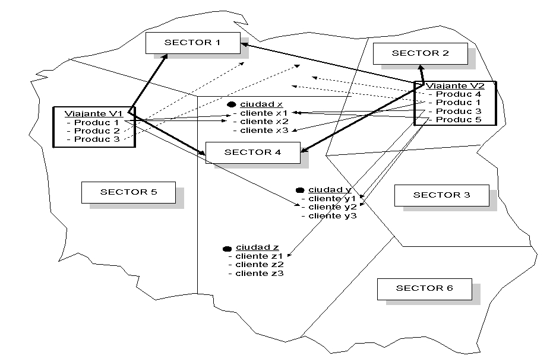

-->

##  Ejercicio 10

Realizar el esquema relacional correspondiente a un Parque Zoológico que quiere guardar información de las especies que tiene, los empleados (cuidadores y guías), y los distintos itinerarios de visita que ofrece.

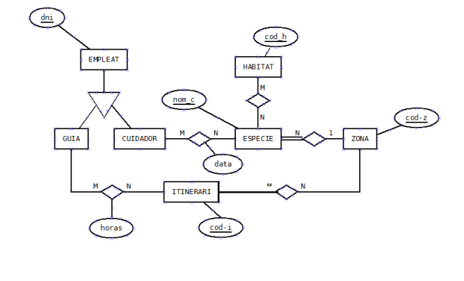

<!--
Hacer el esquema E/R y posteriormente pasarlo a relacional correspondiente a un Parque Zoológico que quiere guardar información de las especies que tiene, los empleados (cuidadores y guías), y los distintos itinerarios de visita que ofrece.

La información está estructurada de la siguiente manera:

  * Especies: de las especies nos interesa saber el nombre, el nombre científico y una descripción general. Se ha de tener en cuenta que una especie puede vivir en diferentes hábitats naturales y que un hábitat puede ser ocupado por diferentes especies. Por otro lado, las especies están en distintas zonas del parque de manera que cada especie está en una zona y en una zona hay unas cuantas especies. 

  * Hábitats: los diferentes hábitats naturales vienen definidos por el nombre, el clima y el tipo de vegetación predominantes. 

  * Zonas: las zonas del parque en las cuales están las distintas especies vienen definidas por el nombre y la extensión que ocupan. 

  * Itinerarios: los itinerarios discurren por distintas zonas del parque. La información de interés para los itinerarios es: código de itinerario, duración del recorrido, longitud del itinerario, el máximo número de visitantes autorizado y el número de distintas especies que visita (que han de ser todas las de las zonas que recorre). Un itinerario recorre distintas zonas del parque y una zona puede ser recorrida por diferentes itinerarios. 

  * Empleados: de todos los empleados querremos saber el nombre, dni, dirección, teléfono y fecha en que empezaron a trabajar en el zoo. Los empleados pueden ser de dos tipos: guías y cuidadores. 

    * Guías: Interesa saber qué guías llevan cada itinerario, teniendo en cuenta que un guía puede llevar unos cuantos itinerarios y que un itinerario puede ser asignado a más de un guía en diferentes horas. Estas horas son un dato de interés. 

    * Cuidadores: se encargan de cuidar las diferentes especies. Un cuidador puede encargarse de unas cuantas especies y una especie puede ser atendida por unos cuantos cuidadores. Nos interesa la fecha en la cual un cuidador se hace cargo de una especie. 
-->

Licenciado bajo la [Licencia Creative Commons Reconocimiento NoComercial CompartirIgual 3.0](http://creativecommons.org/licenses/by-nc-sa/3.0/)
