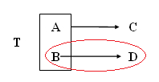
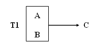
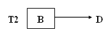
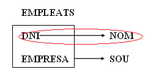
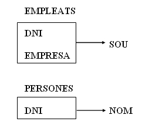

# 4. Segunda Forma Normal (2FN)

 
Se dice que una tabla está en 2FN si y solo si cumple dos condiciones:
<ul>
    <li>Se encuentra en 1FN.</li>
    <li>Todo atributo secundario (aquellos que no pertenecen a la clave principal, los que se encuentran fuera de la caja) depende totalmente (tiene una dependencia funcional total) de la clave completa y, por tanto, no de una parte de ella.</li>
</ul>    

  
---  
  
Esta forma normal solo se considera si la clave principal es compuesta, y por tanto, está formada por varios atributos.

Si una tabla **T** tiene como atributos **A, B, C, D** y la clave es **A . B** cumpliéndose las dependencias:

**A . B** →**C**

**B** →**D**

Se observa que la tabla no se encuentra en 2FN ya que el atributo D no tiene una dependencia funcional total con la clave completa A . B, sino con una parte de la clave (B). El grafo de las dependencias funcionales sería:  

****

**Si existe una flecha que sale del interior de la caja que engloba la clave, entonces la tabla no está en 2FN.**
****

**<u>Poner en 2FN</u>**

Para convertir una tabla que no está en segunda forma normal a 2FN, se realiza una proyección y se crea:

**A)** Una **primera tabla** con la clave y todas sus dependencias totales con los atributos secundarios afectados:

>   
>

****

**B)** Una **segunda tabla** con la parte de la clave que tiene dependencias, y los atributos secundarios implicados:

> 

****

> La clave de la nueva tabla T2 será la antigua parte de la clave.

**Ejemplo**: Tabla con las personas que trabajan en diversas empresas con el sueldo correspondiente, con los atributos: **DNI, NOMBRE, EMPRESA, SUELDO**

Entre los atributos existen las dependencias:

****

**DNI** →**NOMBRE**

**DNI . EMPRESA** →**SUELDO**

El grafo que muestra las dependencias es el siguiente:

Es evidente que la tabla no se encuentra en 2FN, tras normalizar se obtiene:

De manera que la representación de las tablas al **modelo relacional** quedaría de la manera siguiente:

<pre><cod>
            EMPLEADO(<b>dni, empresa</b>, sueldo)
            PERSONA(<b>dni</b>, nombre)
</cod></pre>

****

Licenciado bajo la [Licencia Creative Commons Reconocimiento NoComercial SinObraDerivada 3.0](http://creativecommons.org/licenses/by-nc-nd/3.0/)
