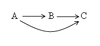
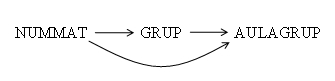

# 5. Dependencia Funcional Transitiva

La dependencia funcional transitiva se aplica para analizar las tablas en tercera forma normal (3FN). Consiste básicamente en considerar que **un atributo no primario solo debe conocerse a través de la clave principal o claves secundarias** (atributos que, aunque no son claves principales, sirven para identificar de manera única una fila en algunos contextos específicos). En otro caso, estará produciendo redundancia de información con las anomalías típicas que lleva consigo.

En términos simples, esta dependencia ocurre cuando un atributo no clave (o no primario) depende indirectamente de la clave principal mediante otro atributo.

 

<b>Dependencia transitiva:</b> A→B→C. Si A→B y B→C, entonces decimos que C depende de forma transitiva de A.

 
---  
<!--
Supongamos tres subconjuntos distintos de atributos A, B y C que pertenecen a una tabla T, de manera que se cumplen las condiciones: <b>A</b> → <b>B</b> y <b>B</b> −∕→ <b>A</b>. Se dice que C tiene una <b>dependencia funcional transitiva</b> con A o que es transitivamente dependiente de A si se cumple que <b>B</b> →<b>C</b> 
--> 
  
Gráficamente se puede mostrar:

Por lo tanto, un atributo C es transitivamente dependiente de otro A si se conoce por diferentes vías, una directamente, y otra a partir de otro atributo intermedio B.

Por ejemplo, consideremos tres atributos que forman parte de la tabla ALUMNOS:

* NUMMAT = nº de matrícula.
* GRUPO = Grupo asignado.
* AULAGRUPO = Aula asignada al grupo.

>>> **NUMMAT** →**GRUPO | AULAGRUPO**

>>> **GRUPO** →**AULAGRUPO**

  
El atributo AULAGRUPO es transitivamente dependiente de NUMMAT, ya que se puede conocer por medio del atributo NUMMAT y a través del atributo GRUPO

Licenciado bajo la [Licencia Creative Commons Reconocimiento NoComercial SinObraDerivada 3.0](http://creativecommons.org/licenses/by-nc-nd/3.0/)
