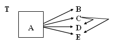
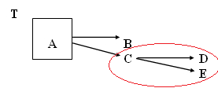
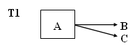
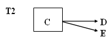
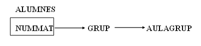
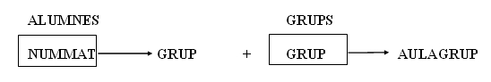

# 6. Tercera Forma Normal (3FN)

 
Se dice que una tabla está en 3FN si y solo si se cumplen dos condiciones:
<ul>
  <li>Se encuentra en 2FN.</li>
  <li>No existen atributos no primarios (atributos que no forman parte de la clave principal) que sean transitivamente dependientes de cada clave candidata de la tabla.</li>
</ul>

  
---  
  
Esto significa que un atributo secundario solo se puede conocer a través de la clave principal o claves candidatas de la tabla y no por medio de otro atributo no primario.

En el grafo de dependencias solo deben mostrarse las dependencias transitivas y no aquellas dependencias funcionales a partir de las claves candidatas, porque se sabe que por ser claves ya conocen todos los atributos.

Ejemplo: A es la clave principal, B es una clave candidata y se dan las siguientes dependencias:

**A** →**B B** →**A C** →**D**

**A** →**C B** →**C C** →**E**

**A** →**D B** →**D**

**A** →**E B** →**E**

El grafo queda del siguiente modo:  

   O bien      

  

Las flechas que muestran las dependencias funcionales que tiene la clave candidata B no se representan (como hemos dicho anteriormente) porque son evidentes y no simplifican la visión del grafo. Además, para la normalización, no se necesitan para nada; por el contrario, suelen complicar el análisis.

La tabla T no está en 3FN ya que los atributos D y E son transitivamente dependientes respecto de la clave A.

**<u>Poner en 3FN</u>**

Para normalizar una tabla que no esté en tercera forma normal, es decir, que tenga dependencias transitivas, descompondremos la tabla en más de una tabla:

**A)** Una **primera tabla** con la clave principal más los atributos que no dependen transitivamente

> 

**B)** Una **segunda tabla** con los atributos que dependen transitivamente, más el atributo del que dependen, que será clave principal

>   
>

Se hará una descomposición por cada dependencia transitiva que haya que afecte a campos distintos.

Para el ejemplo de los atributos NUMMAT, GRUPO y AULAGRUPO tenemos el siguiente grafo:

  

  

Una vez descompuesta la tabla en dos según el algoritmo anterior, tendremos dos tablas

****

Las dos tablas resultantes sí se encuentran en 3FN.

De manera que la representación de las tablas al **modelo relacional** quedaría de la siguiente manera:
<pre><cod>
    ALUMNOS(<b>nummat</b>, grupo)
    GRUPOS(<b>grupo</b>, aulagrupo)
</cod></pre>
****

Y en el ejemplo visto en el apartado 3.3 

La solución quedaría así:

 

 

Licenciado bajo la [Licencia Creative Commons Reconocimiento NoComercial SinObraDerivada 3.0](http://creativecommons.org/licenses/by-nc-nd/3.0/)
