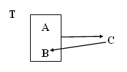
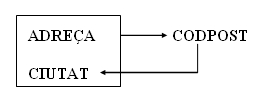
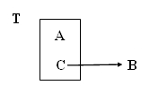
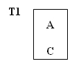
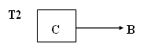
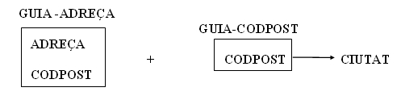

# 7. Forma Normal Boyce-Codd (FNBC)

Tras la creación de la 3FN se observó, posteriormente, que podían haber anomalías que no eran abordadas. De todas formas son unas redundancias ya muy extrañas, y que a veces no valdrá la pena considerarlas.  

Son casos de tablas que aunque están en 3FN, mantienen una dependencia de un atributo secundario con parte de la clave. Es el único caso de dependencia transitiva que se nos podía haber escapado. Gráficamente es el siguiente caso:

 
Una tabla T está en FNBC si y solo si está en 1FN y las únicas dependencias funcionales elementales son aquellas en las cuales la clave principal (y claves candidatas) determinan un atributo.

---  
  

La definición engloba la 3FN ya que las dependencias transitivas existen por medio de atributos secundarios que no eran clave.

Si la clave está formada por un único atributo y ya estaba en 3FN, la tabla está en FNBC (como sucedía con la 2FN).

<u>**Ejemplo**</u>: Tabla de una guía de calles

**GUÍA DE CALLES**

**<u>DIRECCIÓN</u>** |  **<u>CIUDAD</u>** |  **CODPOST**  
---|---|---  
C/ Pez, 2  |  Benicarló  |  12580   
C/ Luz, 5  |  Benicarló  |  12580   
C/ Mar, 4  |  Castelló  |  12005   
C/ Sol, 4  |  Vinaròs  |  12500   
C/ Sal, 9  |  Castelló  |  12004   
C/ Mar, 4  |  Vinaròs  |  12500   
  
Las dependencias funcionales que nos encontramos son:

**DIRECCIÓN . CIUDAD** →**CODPOST**

**CODPOST** →**CIUDAD**

Gráficamente:

Si observamos atentamente las tuplas de una tabla como esta, veremos que para un mismo código postal existen multitud de tuplas que se corresponden con la misma ciudad (tantas como direcciones haya diferentes), por lo tanto existe información duplicada.

Si la información, una vez que se da de alta no varía, es más rentable que la dependencia funcional **CODPOST** → **CIUDAD** se encuentre en otra tabla y que exista una sola tupla para cada código postal.

Además, ¿qué sucede si se elimina la tupla con dirección "C/ Sol, 4" de "Vinaròs" e la tupla "C/ Mar, 4" de "Vinaròs"? Lo que ocurre es que desaparece la relación entre el código postal "12500" y "Vinaròs" y quizás estos datos deberían mantenerse.

Si analizamos con más detalle la tabla, veríamos que en realidad se puede sustituir la clave principal por **A + C** (en el ejemplo **DIRECCIÓN + CÓDIGO POSTAL**), ya que si A + B ya era clave principal, como por cada valor de C solo podemos tener uno de B, la combinación A + C también podrá identificar unívocamente cada ocurrencia de la tabla. Por lo tanto, si sustituyéramos la clave principal, ya no tendríamos dudas de cómo normalizar la tabla, que será justamente como veremos a continuación:

  es equivalente a     
  

**Poner en FNBC**

El algoritmo de descomposición que se aplica a una tabla que no está en FNBC es el siguiente:

Si tenemos una dependencia funcional **C → B** donde **C** y **B** son disjuntos, **C** es un atributo no primario, y **B** forma parte de la clave.

Se obtienen las proyecciones:

> **A)** Una **primera tabla T1** con todos los atributos, excepto **B** (el que formaba parte de la clave principal); ahora formará parte de la clave principal **C**.

> **B)** Una **segunda tabla T2** con los atributos **C** e **B**, y será la clave principal **C**

En el ejemplo inicial de esta pregunta quedará:

**A)**  

    

**B)** 

    
  
En el ejemplo de la GUÍA DE CALLES:

Y quedarían con la siguiente información:

**GUÍA-DIRECCIÓN**

| **<u>DIRECCIÓN</u>** |  **<u>CODPOST</u>** 
---|---
C/ Pez, 2  |  12580   
C/ Luz, 5  |  12580   
C/ Mar, 4  |  12005   
C/ Sol, 4  |  12500   
C/ Sal, 9  |  12004   
C/ Mar, 4  |  12500     

**GUÍA-CODPOST**

| **<u>CODPOST</u>** |  **CIUDAD**  
---|---  
12004  |  Castelló   
12005  |  Castelló   
12500  |  Vinaròs   
12580  |  Benicarló   
  

Por último, observemos las tablas que nos quedan. ¿Querremos tener una tabla de códigos postales? Si el diseño es para Correos o Telefónica, o una empresa grande que tenga muchos clientes y los quiere tener distribuidos por códigos postales, pues seguro que sí.

Pero si se trata de una empresa no demasiado grande, y que tampoco interesa demasiado la distribución por códigos postales, seguramente mantener una tabla de códigos postales puede parecer incluso ridículo. Entonces, mantener la tabla en 3FN y asumir la poquita redundancia que supone no tenerla en FNBC, puede ser incluso saludable. Por eso se ha comentado desde el principio del tema la importancia de normalizar hasta la 3FN, y la FNBC tiene una importancia relativa.

De manera que la representación de las tablas al **modelo relacional** quedaría de la siguiente manera:
<pre><cod>
    GUIA-DIRECCIÓN(<b>dirección, codpos</b>)
    GUIA-CODPOST(<b>codpost</b>, ciudad)
</cod></pre>
****

Licenciado bajo la [Licencia Creative Commons Reconocimiento NoComercial SinObraDerivada 3.0](http://creativecommons.org/licenses/by-nc-nd/3.0/)
