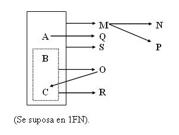
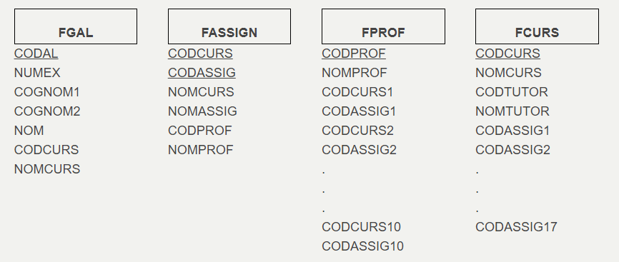
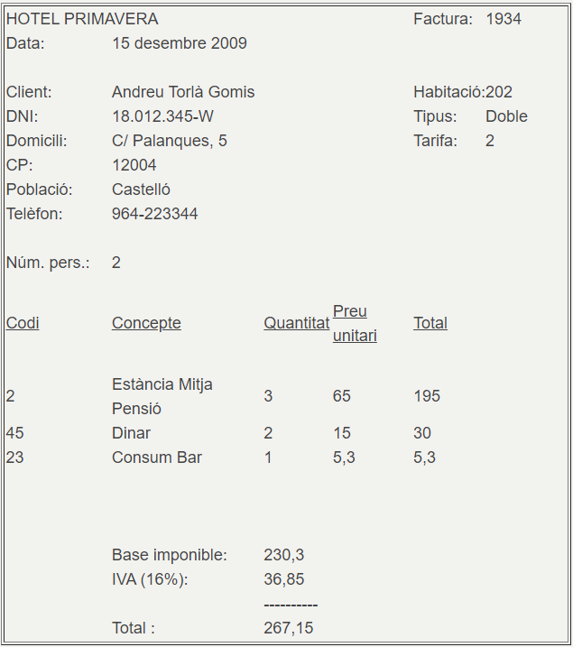
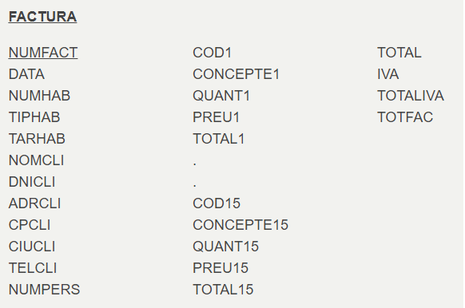

# Ejercicios

##   Ejercicio 1

Normalizar la tabla relacional que tiene como grafo de dependencias funcionales el siguiente:

Podéis normalizarlo todo directamente, sin tener que pasar primero por 2FN, 3FN y FNBC.

##  Ejercicio 2

En un Instituto tienen distribuida la información en los siguientes ficheros:

  
Normalizad los ficheros, si los consideramos tablas de una Base de Datos. Debéis prestar especial atención a ver si está en 1FN.

##  Ejercicio 3

La factura de un hotel es la siguiente:

  
Si consideramos toda la información en una única tabla tendremos:

  
Intentad normalizarla. Prestad especial atención a ver si está en 1FN.

Licenciado bajo la [Licencia Creative Commons Reconocimiento NoComercial SinObraDerivada 3.0](http://creativecommons.org/licenses/by-nc-nd/3.0/)
