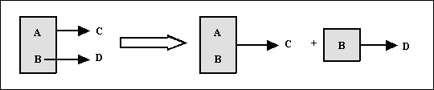
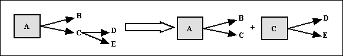
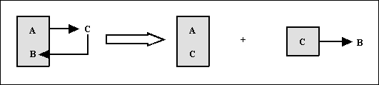

# Resumen

**<u>1FN</u>**  

  
Una tabla está en 1FN si y solo si los valores que componen los atributos de una tupla son atómicos.

Se descompone la tabla en dos

> 1a.- Proyección de la clave junto con los atributos que tienen valores atómicos.

> 2a.- Nueva clave con los atributos que tienen valores múltiples (hay que idear una nueva clave).

**<u>2FN</u>**  
  

 
Se dice que una tabla está en 2FN si y solo si cumple dos condiciones:
<ul>
    <li>Se encuentra en 1FN.</li>
    <li>Todo atributo secundario (aquellos que no pertenecen a la clave principal, los que se encuentran fuera de la caja) depende totalmente (tiene una dependencia funcional total) de la clave completa y, por tanto, no de una parte de ella.</li>
</ul>    

Se descompone la tabla en dos

> 1a.- Una tabla con la clave y todas sus dependencias totales.

> 2a.- Otra tabla con la parte de la clave que tiene dependencias, y los atributos secundarios implicados.

**<u>3FN</u>**  
  

 
Se dice que una tabla está en 3FN si y solo si se cumplen dos condiciones:
<ul>
  <li>Se encuentra en 2FN.</li>
  <li>No existen atributos no primarios (atributos que no forman parte de la clave principal) que sean transitivamente dependientes de cada clave candidata de la tabla.</li>
</ul>

  

Se descompone la tabla en dos

> 1a.- Una tabla con la clave y todos los atributos no primarios que no son transitivos.

> 2a.- Otra tabla con los atributos transitivos y el atributo no primario (que será la clave de la nueva tabla).

**<u>FNBC</u>**  
  

 
Una tabla T está en FNBC si y solo si está en 1FN y las únicas dependencias funcionales elementales son aquellas en las cuales la clave principal (y claves candidatas) determinan un atributo.

Se descompone la tabla en dos

> 1a.- Una tabla con todos los atributos menos la parte de la clave dependiente del atributo secundario. La clave está formada por el resto de la clave y el atributo secundario del que dependía parte de la clave.

> 2a.- Otra tabla en la que el atributo del que depende parte de la clave será la nueva clave y esa parte de la clave como atributo secundario.

Licenciado bajo la [Licencia Creative Commons Reconocimiento NoComercial SinObraDerivada 3.0](http://creativecommons.org/licenses/by-nc-nd/3.0/)
