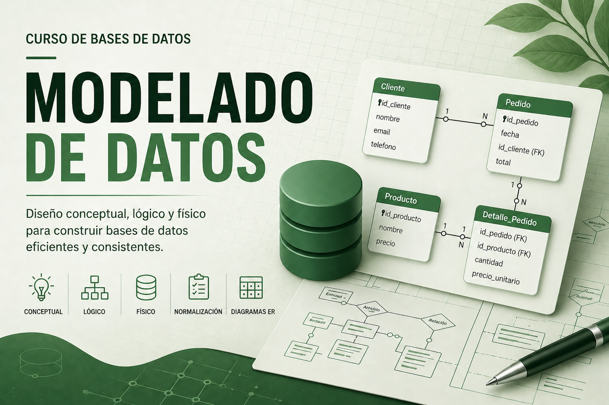

<!--
<video width="620" height="440" controls>
  <source src="T02_Portada.mp4" type="video/mp4">
  Tu navegador no soporta la etiqueta de vídeo.
</video>
-->

Bienvenidos al material de apoyo y documentación del curso de Modelado de Datos. Utiliza el menú superior para acceder a contenidos sobre diagramas entidad-relación, modelo relacional y normalización.

Licenciado bajo la [Licencia Creative Commons Reconocimiento CompartirIgual
2.5](http://creativecommons.org/licenses/by-sa/2.5/)